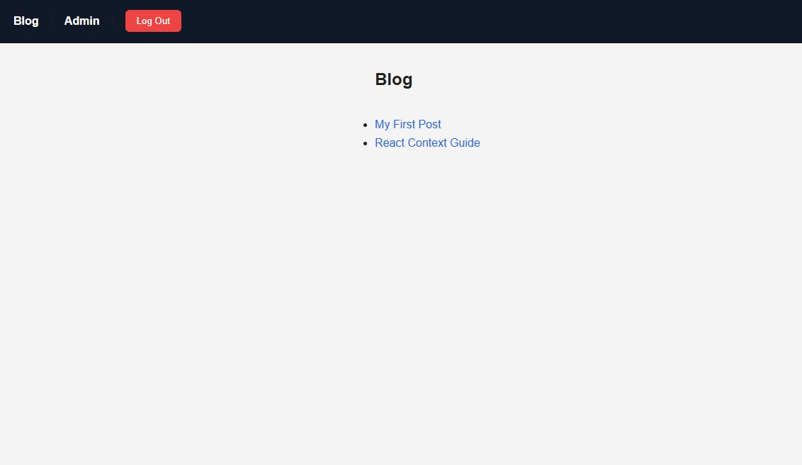

### Dynamic Routing - Project

This project is a simple blog application built using  **React, React Router, and Context API** . It demonstrates dynamic routing, authentication simulation, and protected routes without using a real backend.

Screenshot

